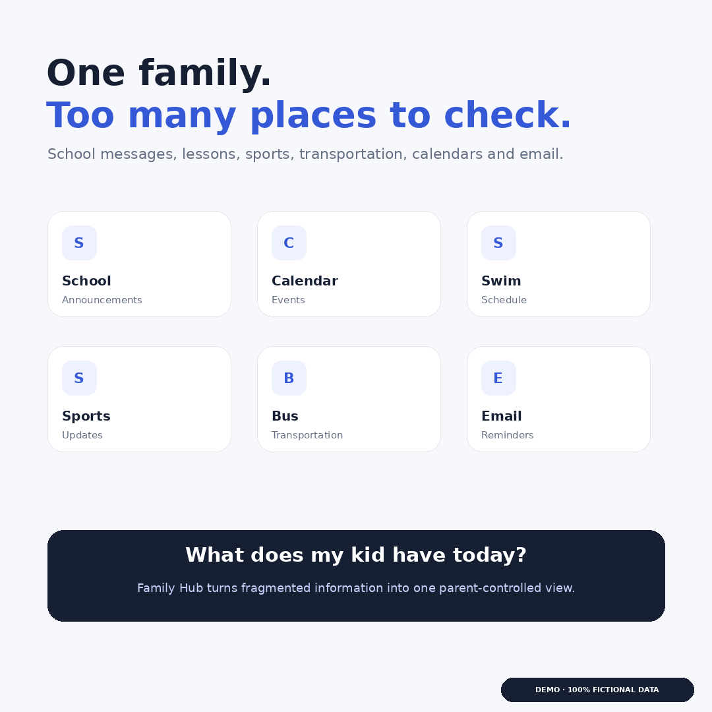

# Privacy-First Family Hub

> A documentation-first case study about organizing family logistics without creating another cloud repository of sensitive child data.

## The problem

A family's schedule rarely lives in one place. School communications, activity schedules, sports notifications, transportation updates, forms, payments, and personal calendars all arrive through different systems.

Each source can be correct on its own while the combined family plan is impossible.

**Example:** PTA popcorn pickup is Thursday at 3:30 PM. Swimming starts at 4:00 PM. Neither system knows about the other, so neither identifies the transportation conflict.

## The prototype

Family Hub is a personal prototype that combines parent-provided schedules and forwarded notifications into one local, parent-controlled view. It helps answer four questions:

1. What is happening today and this week?
2. What requires a parent's attention?
3. What changed?
4. Where might plans conflict?

## Privacy boundary

The current prototype does **not** send family communications or child data to a third-party AI model.

- Dashboard information is stored locally in the parent's browser.
- A dedicated inbox is used instead of unrestricted access to a personal mailbox.
- A parent reviews and approves extracted information before it reaches the schedule.
- The local review queue does not retain original email bodies or attachments.
- Only the minimum structured schedule information is retained.
- The public demonstration uses entirely fictional names, organizations, locations, dates, and schedules.

Forwarded messages still exist in the dedicated Gmail account. This project therefore describes the system as **local-first**, not as fully offline or cloud-free.

## Case-study contents

- [User scenarios](user-scenarios.md)
- [Privacy design](privacy-design.md)
- [Architecture](architecture.md)
- [Product decisions and tradeoffs](decisions.md)
- [Threat model](threat-model.md)
- [Roadmap](roadmap.md)

## What this repository is—and is not

This is a sanitized product and privacy case study. It intentionally does not contain the working application's source code, inbox credentials, configuration, real schedules, real communications, or identifiable family information.

The goal is to share the problem-solving process before deciding whether any implementation should be open-sourced.

## Guiding principle

> Organize the family schedule—not the family's private life.

