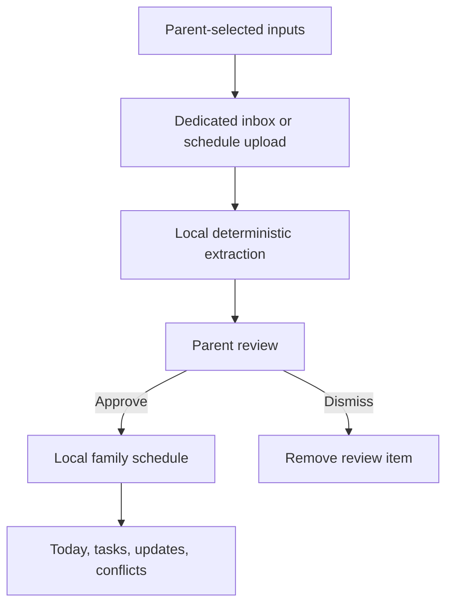
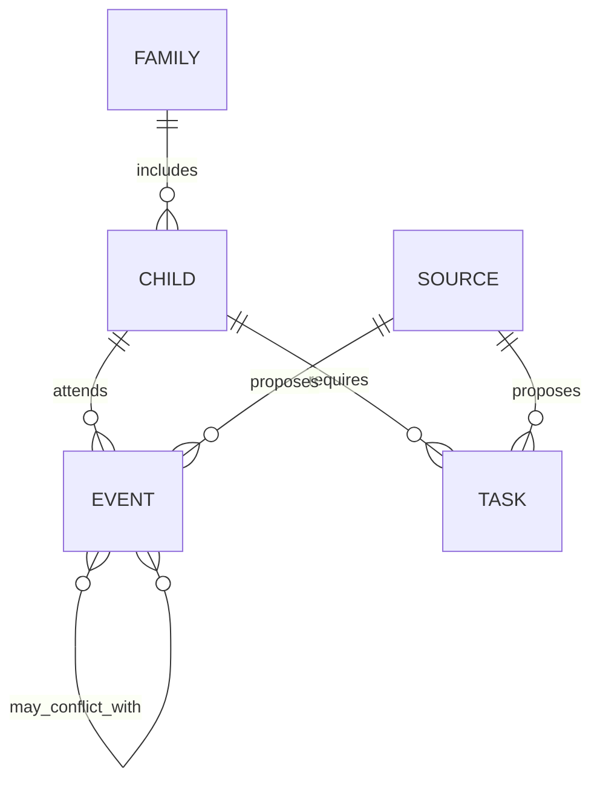

# Architecture

## Current data flow

## Trust boundaries

| Boundary | Current behavior |
|---|---|
| Personal mailbox | Not connected |
| Dedicated Gmail inbox | Contains messages intentionally forwarded by the parent |
| Local ingestion process | Reads approved inbox inputs and creates structured proposals |
| Review queue | Stores minimum extracted fields; not full message bodies or attachments |
| Browser dashboard | Stores parent-approved schedule information locally |
| Third-party AI model | Not used in the current prototype |
| Public demo | Uses independently created fictional data |

## Core information model

The model centers on family logistics—not a comprehensive child profile.

